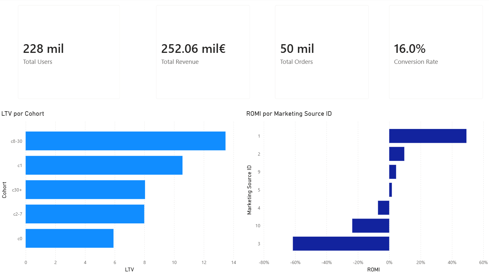
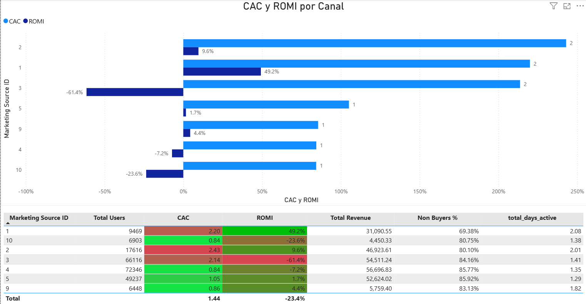

# Análisis de Crecimiento y ROI de Marketing para Ticketing 

Este proyecto analiza el comportamiento de los usuarios y la eficiencia de los canales de marketing para una plataforma de venta de entradas. El objetivo principal es optimizar la inversión publicitaria, identificar cohortes de clientes de alto valor y generar recomendaciones accionables basadas en datos.

## Contexto del Proyecto

La empresa busca entender cómo los clientes utilizan el servicio, cuándo deciden comprar, cuánto valor aportan a largo plazo (LTV), y si los gastos de marketing realmente generan un retorno positivo (ROMI). Para ello, se analizaron datos de visitas, pedidos y costos de marketing desde junio de 2017 hasta mayo de 2018.

## Metodología y Hallazgos Clave

El análisis se estructuró en cuatro fases, integrando el comportamiento del usuario con el desempeño financiero de los canales.

### 1. Análisis Exploratorio de Datos (EDA)
- **Limpiar y estructurar datos:** Se corrigieron tipos de datos y se eliminaron duplicados.
- **Sesiones y retención:** Se identificó que la mayoría de los usuarios solo visita la plataforma un único día (mediana de 1 día activo). Solo el 19.7% regresa en días distintos.
- **Intensivos de un solo día:** Se descubrió que los usuarios que realizan múltiples sesiones en un mismo día (pero no regresan al día siguiente) tienen una tasa de compra del 40.60%, frente al 10.47% de los de una sola sesión (Z-test, p=0). Esto es una señal clara de alta intención de compra.
- **Duración de sesión:** Los compradores pasan significativamente más tiempo en la plataforma que los no compradores (Mann-Whitney U, p<0.0001).
- **Estacionalidad:** Se detectaron picos en noviembre (Black Friday) y valles en agosto. El pico de noviembre fue impulsado principalmente por usuarios recurrentes, que compraron al 44.86% frente al 33.77% anual.

### 2. Cohortes de Conversión
Se segmentó a los usuarios compradores por el tiempo transcurrido entre su primera visita y su primera compra.
- **C0 (Compra inmediata):** 72.2% de los compradores. LTV de $5.92. Estrategia: Upselling inmediato.
- **C8-30 (de 8 a 30 días):** Solo el 6% de los compradores, pero la cohorte más valiosa. LTV de $13.47 y ticket promedio de $7.82. Estrategia: Retargeting y campañas de recordatorio.
- **C30+ (más de 30 días):** 13.4% de los compradores. LTV intermedio de $8.04. Estrategia: Campañas de largo plazo y monitoreo.

### 3. Análisis de Marketing (CAC y ROMI)
Se utilizó el modelo de **atribución por primera visita (*first-touch*)** para asignar los ingresos a la fuente de marketing que trajo al usuario, evitando la duplicación de ingresos por múltiples sesiones.
- **Source 1:** El canal más rentable (ROMI 49%). Alta retención (2.08 días) y duración (12.18 min).
- **Source 3:** El canal más ineficiente (ROMI -61%). Alto volumen (66k usuarios), pero el 84% no compra, su retención es baja (1.41 días) y casi no genera valor a largo plazo (C8-30 = 1%).

### 4. Análisis Integrado (Comportamiento + Financiero)
Se cruzaron las métricas de comportamiento (retención, duración y calidad de cohorte) con el ROMI y CAC de cada fuente para diagnosticar el origen de las ineficiencias.

## Recomendaciones Estratégicas (Priorizadas)

| Prioridad | Canal | Recomendación |
| :--- | :--- | :--- |
| **1 (Eliminar)** | **Source 10** | Eliminar inversión (bajo volumen, ROMI -24%). Redirigir presupuesto a Source 1. |
| **1 (Reducir)** | **Source 3** | Reducir inversión en un 80%. El 20% restante se usará para probar nuevo *targeting* con un umbral de éxito de retención > 1.6 días. Concentrar presupuesto en temporada alta (Black Friday). |
| **2 (Optimizar)** | **Source 4** | Optimizar *landing page* para subir la conversión inmediata (C0) del 10% al 12% y volver el ROMI positivo. |
| **2 (Investigar)** | **Source 5** | Investigar distribución horaria y por dispositivo. Si es tráfico de baja calidad, reducir presupuesto un 50%. |
| **3 (Potenciar)** | **Source 1** | Aumentar inversión. Enfocar en *upselling* y *cross-selling* en el checkout. |
| **3 (Mantener)** | **Source 2** | Mantener y aplicar *nurturing* (email a los 5 y 15 días) para empujarlos a la cohorte C8-30 (la de mayor valor). |
| **3 (Vigilar)** | **Source 9** | Mantener presupuesto mínimo. Es un canal de compradores tardíos (C30+). Monitorear su LTV a largo plazo. |

## Dashboard Interactivo (Power BI)

El análisis exploratorio y los hallazgos de marketing se han consolidado en un dashboard de Power BI para facilitar la exploración interactiva de los datos. El archivo `.pbix` se encuentra en la raíz del proyecto.

### Estructura del Dashboard

**1. Página 1: Resumen Ejecutivo**
- KPIs globales: Total de usuarios, Ingresos, Pedidos y Tasa de Conversión.
- LTV por cohorte: Identifica visualmente que C8-30 es la cohorte más valiosa ($13.47).
- ROMI por canal: Compara la rentabilidad de las fuentes de marketing (Source 1 = 49%, Source 3 = -61%).

**2. Página 2: Eficiencia de Marketing**
- Gráfico de barras agrupadas mostrando CAC y ROMI por cada canal (`source_id`).
- Tabla detallada con las métricas de calidad de tráfico (retención, duración, porcentaje de compradores).
- *(Nota: Los filtros de cohorte no se aplican aquí, ya que el ROMI y el CAC son métricas fijas por canal de adquisición).*

**3. Página 3: Análisis de Cohortes**
- LTV, Ticket Promedio y Pedidos por Usuario segmentados por cohorte (C0, C1, C2-7, C8-30, C30+).
- **Filtro interactivo:** Permite seleccionar `desktop` o `touch` para ver cómo varía el LTV de cada cohorte según el dispositivo.

### Cómo usarlo
1. Descarga el archivo `growth_analytics_dashboard`.
2. Ábrelo con Power BI Desktop (gratuito).
3. Explora las páginas y utiliza los filtros (slicers) para profundizar en los segmentos de usuarios y canales.

### Vista previa (Capturas de pantalla)




## Estructura del Proyecto

```text
├── datasets/
│   ├── processed/
│   │   ├── cohort_metrics_powerbi.csv
│   │   ├── marketing_analysis_powerbi.csv
│   │   └── user_profile_powerbi.csv
│   ├── costs_us.csv
│   ├── orders_log_us.csv
│   └── visits_log_us.csv
├── images/
│     ├──dashboard_page1.png
│     ├──dashboard_page2.png
│     ├──dashboard_page3.png
├── growth_analytics_v2.ipynb
├── growth_analytics_dashboard.pbix
├── README_ENG.md
└── README_ESP.md

